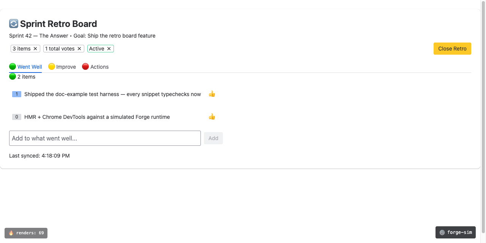

# forge-sim

A local, simulated runtime for [Forge](https://developer.atlassian.com/platform/forge/), Atlassian's platform for building apps that run inside their cloud products, three ways to drive it:

* **Automated testing** — Ihis is the missing test harness for Forge. Out of the box, your options are mocking or shimming every `@forge/*` import by hand, or deploying to find out. forge-sim gives you a robust API for automated testing. You can invoke resolvers, fire product events, assert on KVS/SQL state and rendered UIKit output. No network or credentials required, runs in CI.

* **Local development** — think LocalStack for Forge. It collapses the deploy-wait-debug iteration loop by giving you an instantaneous deploy to a local runtime. Run your app against simulated storage, product APIs, and triggers, with dev tools for inspecting Forge state as you go. Orders of magnitude faster than iterating via `forge tunnel`

* **AI-assisted development (MCP)** — let an agent deploy, invoke, render, and inspect your app in a simulated Forge environment via MCP tools instead of handing it your cloud credentials or a browser pointed at your dev site. Faster feedback and you control the blast radius: fully sandboxed until you connect a real account.

**This project is not endorsed by or affiliated with Atlassian**

## Scope

forge-sim is a *mostly* truthful forge implementation. The goal is if it works in forge-sim, it should work in Forge, and vice versa. That said, there is a lot of real estate to cover. The [implementation matrix](./docs/reference/implementation-matrix.md)
shows exactly what's implemented and how faithfully. If something you rely on
is missing or behaves differently, please [open an issue](https://github.com/ryanackley/forge-sim/issues).

Keep in mind, **This is a development tool**. Iterate here, then a full deploy to the Atlassian products for final testing.

## Installation

Requires **Node.js 22.18+** (uses native TypeScript type stripping for `.ts` loader hooks, unflagged since 22.18). The package is **ESM-only**: `require('forge-sim')` throws `ERR_PACKAGE_PATH_NOT_EXPORTED`; use `import` (or dynamic `import()` from CommonJS).

```bash
# Global install (CLI: dev server, agent commands, MCP)
npm install -g forge-sim

# And/or as a dev dependency (CI/CD testing with the programmatic API)
npm install --save-dev forge-sim
```

The docs assume the global install. Prefer not to install globally? Substitute `npx forge-sim` anywhere you see `forge-sim`.

> **Install warnings are safe to ignore.** npm prints Atlaskit peer-dependency conflicts (`@atlaskit/analytics-next-stable-react-context` and `react-scrolllock` still declare React 16) and, on npm 11.6+, skips two postinstall scripts. Neither script needs to run: esbuild ships its native binary as an optional dependency resolved at runtime, and iframe-resizer's script is only a funding notice.

## Automated testing

Test your app against a headless local runtime. The test API creates a simulated deployment of your unmodified app and exposes its storage, queues, triggers, and a rendered UIKit2 tree for assertions.

```typescript
import { describe, it, expect, beforeAll, afterAll } from 'vitest';
import { createSimulator, type ForgeSimulator } from 'forge-sim';

describe('my forge app', () => {
  let sim: ForgeSimulator;

  beforeAll(async () => {
    sim = createSimulator();
    await sim.sql.start();              // embedded MySQL, only if the app uses @forge/sql
    await sim.deploy('./my-forge-app'); // manifest.yml drives everything
  });

  afterAll(async () => {
    await sim.stop();
  });

  it('reads an issue and records a view', async () => {
    sim.mockProductRoutes('jira', {
      '/rest/api/3/issue/PROJ-1': { key: 'PROJ-1', summary: 'Fix the thing' },
    });

    // The resolver runs your real handler, which writes to KVS
    const data = await sim.invoke('getIssue', { issueKey: 'PROJ-1' });
    expect(data.summary).toBe('Fix the thing');
    expect(await sim.kvs.get('views:PROJ-1')).toBe(1);
  });

  it('handles an issue-created trigger', async () => {
    await sim.fireTrigger('avi:jira:created:issue', { issue: { key: 'PROJ-2' } });

    const rows = await sim.sql.query(
      'SELECT * FROM objectives WHERE status = ?',
      ['active'],
    );
    expect(rows).toHaveLength(3);
  });

  it('renders the issue panel', async () => {
    // Headless UIKit 2: your JSX runs through the real @forge/react reconciler
    await sim.ui.render('issue-panel', { issueKey: 'PROJ-1' });

    // Wait for useEffect → invoke → re-render to settle, then assert on the tree
    const doc = await sim.ui.waitForContent('issue-panel', 'Fix the thing');
    const badge = sim.ui.findByTypeAndText(doc, 'Badge', '1 view');
    expect(badge.props.appearance).toBe('primary');
  });
});
```

Features:

- Runs your real handler code through the actual `@forge/*` packages, not hand-written mocks.
- Invokes resolvers, triggers, scheduled triggers, queues, and consumers directly.
- Gives direct read/write access to KVS, the Custom Entity Store, and Forge SQL (embedded MySQL) for setup and assertions.
- Renders UIKit 2 modules to a ForgeDoc tree you can query and interact with; no browser.
- Mocks product APIs, Forge Remotes, third-party OAuth, and GraphQL by route; unmocked routes can be configured to fall through to a connected real API.
- Mocks and records `@forge/llm` calls so tests stay offline.

> **Note:** if your app uses `@forge/sql`, the first `sim.sql.start()` on a machine downloads a MySQL binary (one-time, needs network access). Everything else runs fully offline. See the [testing guide](./docs/testing/) for CI caching tips.

**Full guide:** [Automated testing](./docs/testing/) — bundler configuration, every testing pattern, UIKit rendering, mocking, and the programmatic API reference.

---

## Local development loop

Run your Forge app locally by using the `forge-sim dev` command. This is the end-to-end app experience being driven by a browser. 

### Quick start

Navigate to your forge app directory and run forge-sim in dev mode. This will launch a browser tab that shows a navigable index of all of your UI modules. Click on one to run outside of Atlassian products. 

```bash
cd /path/to/forge/app
forge-sim dev
```

Dev mode features:

- **UIKit 2 and Custom UI** — uses Atlaskit to render UIKit 2 components. Supports Hot Module Reload (HMR) and Chrome Devtools. 
- **Simulates Forge services locally** — Functions, queues, consumers, SQL, KVS, etc.
- **Real API access** — connect your Atlassian account and `requestJira()` hits your real site
- **Local Debugging tools** — KVS browser, SQL console, log viewer, event triggers at `localhost:5173/__tools/`
- **Persistent state** — KVS and SQL survive restarts. `--clean` to start fresh.

<p align="center">
  
</p>

<!--
TODO(demo): record dev-mode demo video and add it above.
To embed on GitHub: edit this file on github.com and drag the .mp4/.mov in;
it uploads to user-attachments and inserts a bare URL on its own line, which
GitHub renders as an inline player. (GIFs in the repo work too: docs/media/)
-->

**Full guide:** [Local development](./docs/local-development/) — Custom UI and proxy mode, the dev tools UI, and the integration stories: talking to Atlassian APIs, third-party APIs, and your own remote backend.

---


## AI-driven development

forge-sim gives AI agents a local Forge runtime that needs no Atlassian credentials and no deploy permissions. Out of the box, an agent can write code, deploy it locally, test it, and iterate without touching a real site. If you *do* connect a real account (`forge-sim auth`), unmocked product API calls pass through to it; mocked routes always win, so you control exactly which calls stay local. Everything is reachable through CLI commands:

```bash
# Deploy the app (daemon auto-starts)
forge-sim deploy ./my-forge-app

# Call a resolver to test it
forge-sim invoke getIssues '{"project": "PROJ"}'

# Check what the UI looks like
forge-sim ui

# Inspect the data layer
forge-sim kvs list
forge-sim sql "SELECT * FROM objectives"

# Check logs for errors
forge-sim logs
```

The first command auto-starts a background daemon; state persists across calls and the daemon exits after 30 minutes idle.

### MCP server

For AI agents that support [Model Context Protocol](https://modelcontextprotocol.io/), forge-sim exposes the same operations as MCP tools:

<!-- BEGIN:STATS_COMPACT -->
2,513 tests · 41 MCP tools · 4 MCP resources
<!-- END:STATS_COMPACT -->

```bash
# Native MCP over stdio
forge-sim-mcp

# Or via the daemon's HTTP endpoint
forge-sim serve  # starts on random port, writes to ~/.forge-sim/daemon.port
```

The full tool list: `deploy`, `invoke`, `fire_trigger`, `fire_scheduled_trigger`, `ui_state`, `ui_interact`, `kvs_get`, `kvs_set`, `kvs_list`, `queue_push`, `queue_state`, `logs`, `sql_execute`, `sql_migrate`, `sql_schema`, `entity_get`, `entity_set`, `entity_delete`, `entity_query`, `entity_list`, `auth_status`, `mock_routes`, `mock_graphql`, `llm_mock`, `llm_history`, `realtime_publish`, `realtime_state`, `reset`, `objectstore_list`, `objectstore_get`, `objectstore_put`, `objectstore_delete`, `objectstore_create_download_url`, `variables_set`, `variables_unset`, `variables_list`. 143 trigger event templates with typed payloads are built-in for Confluence, Jira, Jira Software, and App Lifecycle events.

### As a Claude Code plugin

This repo doubles as a plugin marketplace. In Claude Code:

```
/plugin marketplace add ryanackley/forge-sim
/plugin install forge-sim@forge-sim
```

That installs the [`forge-local-dev`](./skills/forge-local-dev/) skill and wires up the MCP server in one step. The skill teaches an agent the full develop-and-test loop (deploy, invoke, fire triggers, drive UI, inspect state) across all three driver surfaces, and knows where it fits alongside Atlassian's own forge-skills plugin (scaffolding and review stay with their skills; the iterate loop is this one). Other agent harnesses can use the skill directly: drop `skills/forge-local-dev/` into the agent's skills directory and it activates whenever you're working on a Forge app.

Prefer something lighter? The CLI surface is small enough to paste into an agent prompt:

```
Deploy a Forge app:    forge-sim deploy <dir>
Call a resolver:       forge-sim invoke <functionKey> [payloadJSON]
Fire a trigger:        forge-sim trigger <event> [dataJSON]
Fire a web trigger:    forge-sim webtrigger <key> [--data json]
Check UI state:        forge-sim ui
Read KVS:             forge-sim kvs list
Run SQL:              forge-sim sql "SELECT * FROM ..."
View logs:            forge-sim logs
Reset everything:     forge-sim reset
```

**Full guide:** [AI-driven development](./docs/ai/) — the MCP server (tools and resources), transport options, and the agent CLI.

---


## Known limitations

- **No egress filtering** — `permissions.external` is parsed but not enforced
- **No scope enforcement** — `permissions.scopes` is parsed but not checked at runtime
- **No app lifecycle triggers** — install/uninstall/enable/disable don't fire
- **No rate or memory limits** — Forge's per-app limits aren't simulated
- **`context.environmentType` defaults to `DEVELOPMENT`** — override per render/invoke to simulate staging/prod
- **Other behavioral quirks** - Too many to list here. It's important to test your app in-product. 

Also see the [implementation matrix](./docs/reference/implementation-matrix.md) for full coverage detail.

## Documentation

The docs are organized around the three ways to use forge-sim, with a shared reference section:

- **[Local development](./docs/local-development/)** — the `forge-sim dev` server, connecting to Atlassian, Custom UI and proxy mode, Forge Remotes, external auth, and the dev tools UI.
- **[Automated Testing](./docs/testing/)** — the test API, bundler config, testing patterns, UIKit rendering, mocking, and the programmatic `sim.*` reference.
- **[AI-driven development](./docs/ai/)** — the MCP server and agent CLI.
- **[Reference](./docs/reference/)** — architecture, full CLI reference, implementation matrix, module support, and module contexts.

## Development

```bash
npm install
npm run build               # TypeScript compile
npm test                    # core test suite
cd renderer && npx vitest run   # renderer tests
npm run docs:stats          # sync auto-generated stats blocks in docs
npm run docs:stats:check    # CI guard — fails if stats are stale
```

<!-- BEGIN:STATS -->
**2,513 tests** across **137** test files
(2,357 core / 132 files
+ 156 renderer / 5 files)

**41 MCP tools** + **4 resources**
<!-- END:STATS -->

## License

[MIT](./LICENSE)
