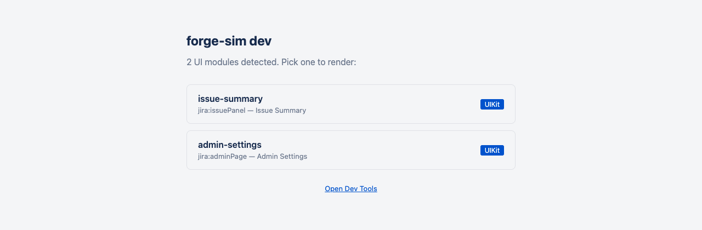
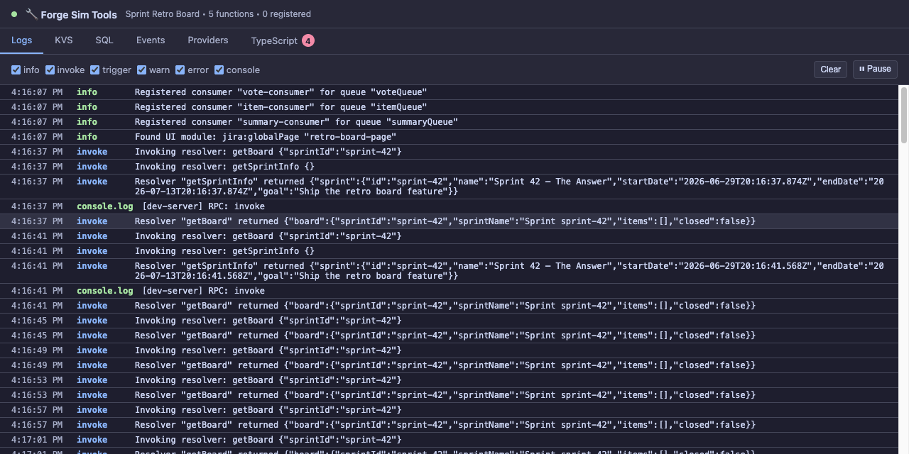

# Local development

Run an unmodified Forge app for development that is completely local to your machine with `forge-sim dev`. It serves your UIKit and Custom UI modules and simulates the backend services (functions, queues, consumers, SQL, KVS).

Iterate faster by not having to deploy to Atlassian's servers to test every change.

```bash
cd /path/to/forge/app
forge-sim dev
```

For the full command and its flags (module selection, context injection, ports, `--clean`, theme), see the [CLI reference](../reference/cli.md#forge-sim-dev).

## Running the dev server

Starting `forge-sim dev` opens a browser tab with the **module index** — every UI module declared in your manifest, with its type and title:



Click a module to render it outside of Atlassian products, with the module's Forge context simulated (issue, project, space — injectable via CLI flags). UIKit modules render through real Atlaskit components, backed by your real resolvers running against the simulated backend. Edits hot-reload, and Chrome DevTools debugs your actual source:


The example above works end-to-end locally: The UIKit interface renders AtlasKit components, the Add buttons push events onto Forge queues, consumers process them, and the board re-renders from KVS — the full async loop, locally.

The **dev tools UI** at `http://localhost:5173/__tools/` is a window into the simulated backend. The log viewer below shows that same app booting: queue consumers registering, resolvers invoked with payloads and return values, and the app's own `console.log` output captured inline. Other tabs give you a KVS browser, SQL console, event trigger panel, OAuth provider connections, and TypeScript diagnostics:



See [Dev tools UI](./dev-tools.md) for the full walkthrough.

## Custom UI and proxy mode

Custom UI pages that are already bundled and referenced in your manifest work out of the box — forge-sim serves them and injects the `@forge/bridge` shim.

While developing, you'll usually run your Custom UI through its own webpack/Vite/Parcel dev server so you get hot reload. Point forge-sim at it with `--proxy`:

```bash
# Start your dev server as usual
cd my-custom-ui-app && npm start  # → http://localhost:3000

# In another terminal, proxy it through forge-sim
forge-sim dev --proxy http://localhost:3000
```

forge-sim sits in front of your dev server and hosts it in an iframe with shimmed Forge APIs, so HMR and Chrome DevTools keep working.

*🎬 Demo video placeholder — proxy mode: Vite dev server running, `forge-sim dev --proxy`, Custom UI inside the simulated Forge frame with HMR.*

<!-- TODO(demo): record proxy-mode demo and replace the line above. To embed on GitHub, edit this file on github.com and drag the .mp4/.mov in. -->

## Atlassian, third party APIs, and remotes

Real apps integrate with things: Atlassian's own APIs, third-party services, your own backend. forge-sim supports all three:

- **[Talking to Atlassian APIs](./atlassian-apis.md)** — connect your real site with a PAT so `requestJira()` / `requestConfluence()` / `requestBitbucket()` return live data.
- **[Talking to third-party APIs](./third-party-apis.md)** — `asUser().withProvider()` OAuth against Google, GitHub, Slack, …: manual tokens or the full live OAuth flow.
- **[Talking to your remote backend](./remotes.md)** — Forge Remotes.

Credential plumbing shared by all three (account management, storage locations, CI environment variables, the LLM key) lives in the [Credentials](./credentials.md) appendix.

## In this section

- [Talking to Atlassian APIs](./atlassian-apis.md)
- [Talking to third-party APIs](./third-party-apis.md)
- [Talking to your remote backend (Forge Remotes)](./remotes.md)
- [Credentials](./credentials.md)
- [Dev tools UI](./dev-tools.md)
